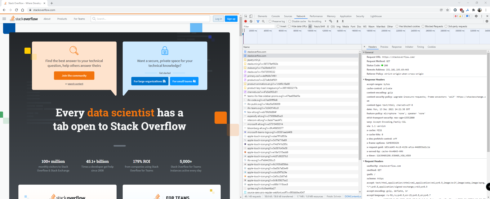
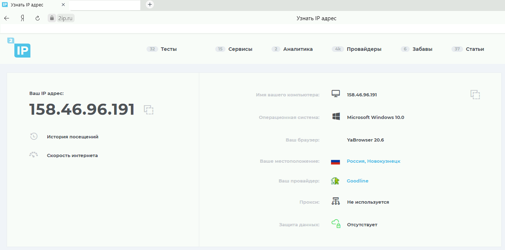

# Домашнее задание по лекции "3.6 Компьютерные сети (лекция 1)"
## 1. Работа c HTTP через телнет.
* Подключитесь утилитой телнет к сайту stackoverflow.com telnet stackoverflow.com 80
* отправьте HTTP запрос
```shell
GET /questions HTTP/1.0
HOST: stackoverflow.com
[press enter]
[press enter]
```
* В ответе укажите полученный HTTP код, что он означает?
### Ответ:
```shell
skelin_ei@mt:~$ telnet stackoverflow.com 80
Trying 151.101.129.69...
Connected to stackoverflow.com.
Escape character is '^]'.
GET /questions HTTP/1.0
HOST: stackoverflow.com

HTTP/1.1 301 Moved Permanently
cache-control: no-cache, no-store, must-revalidate
location: https://stackoverflow.com/questions
x-request-guid: cdd95d69-f981-4abd-9821-d49a210c4701
feature-policy: microphone 'none'; speaker 'none'
content-security-policy: upgrade-insecure-requests; frame-ancestors 'self' https                                                                                                                                                             ://stackexchange.com
Accept-Ranges: bytes
Date: Wed, 04 May 2022 02:54:31 GMT
Via: 1.1 varnish
Connection: close
X-Served-By: cache-hhn4079-HHN
X-Cache: MISS
X-Cache-Hits: 0
X-Timer: S1651632871.259360,VS0,VE85
Vary: Fastly-SSL
X-DNS-Prefetch-Control: off
Set-Cookie: prov=521e383a-c18c-ec1f-371b-8c8fac58758b; domain=.stackoverflow.com                                                                                                                                                             ; expires=Fri, 01-Jan-2055 00:00:00 GMT; path=/; HttpOnly

Connection closed by foreign host.
```
Получен код `301 Moved Permanently`. Данный ответ означает что страница http://stackoverflow.com/questions была перемещена на 
https://stackoverflow.com/questions. 

## 2. Повторите задание 1 в браузере, используя консоль разработчика F12
* откройте вкладку Network
* отправьте запрос http://stackoverflow.com
* найдите первый ответ HTTP сервера, откройте вкладку Headers
* укажите в ответе полученный HTTP код.
* проверьте время загрузки страницы, какой запрос обрабатывался дольше всего?
* приложите скриншот консоли браузера в ответ.

### Ответ:
* Код ответа: `307 Internal Redirect`
* Время загрузки: 1,3 секунды
* дольше всего обрабатывался запрос `GET https://stackoverflow.com/`, 421 мс
### Решение:


## 3. Какой IP адрес у вас в интернете?
### Ответ:
158.46.96.191 


## 4. Какому провайдеру принадлежит ваш IP адрес? Какой автономной системе AS? Воспользуйтесь утилитой whois
### Ответ:
Провайдер: `E-Light-Telecom`  
AS: 39927
### Решение:
```shell
skelin_ei@mt:~$ whois 158.46.96.191

#
# ARIN WHOIS data and services are subject to the Terms of Use
# available at: https://www.arin.net/resources/registry/whois/tou/
#
# If you see inaccuracies in the results, please report at
# https://www.arin.net/resources/registry/whois/inaccuracy_reporting/
#
# Copyright 1997-2022, American Registry for Internet Numbers, Ltd.
#


NetRange:       158.46.0.0 - 158.46.255.255
CIDR:           158.46.0.0/16
NetName:        RIPE-ERX-158-46-0-0
NetHandle:      NET-158-46-0-0-1
Parent:         NET158 (NET-158-0-0-0-0)
NetType:        Early Registrations, Transferred to RIPE NCC
OriginAS:
Organization:   RIPE Network Coordination Centre (RIPE)
RegDate:        2010-11-03
Updated:        2010-11-17
Comment:        These addresses have been further assigned to users in
Comment:        the RIPE NCC region. Contact information can be found in
Comment:        the RIPE database at http://www.ripe.net/whois
Ref:            https://rdap.arin.net/registry/ip/158.46.0.0

ResourceLink:  https://apps.db.ripe.net/search/query.html
ResourceLink:  whois.ripe.net


OrgName:        RIPE Network Coordination Centre
OrgId:          RIPE
Address:        P.O. Box 10096
City:           Amsterdam
StateProv:
PostalCode:     1001EB
Country:        NL
RegDate:
Updated:        2013-07-29
Ref:            https://rdap.arin.net/registry/entity/RIPE

ReferralServer:  whois://whois.ripe.net
ResourceLink:  https://apps.db.ripe.net/search/query.html

OrgAbuseHandle: ABUSE3850-ARIN
OrgAbuseName:   Abuse Contact
OrgAbusePhone:  +31205354444
OrgAbuseEmail:  abuse@ripe.net
OrgAbuseRef:    https://rdap.arin.net/registry/entity/ABUSE3850-ARIN

OrgTechHandle: RNO29-ARIN
OrgTechName:   RIPE NCC Operations
OrgTechPhone:  +31 20 535 4444
OrgTechEmail:  hostmaster@ripe.net
OrgTechRef:    https://rdap.arin.net/registry/entity/RNO29-ARIN


#
# ARIN WHOIS data and services are subject to the Terms of Use
# available at: https://www.arin.net/resources/registry/whois/tou/
#
# If you see inaccuracies in the results, please report at
# https://www.arin.net/resources/registry/whois/inaccuracy_reporting/
#
# Copyright 1997-2022, American Registry for Internet Numbers, Ltd.
#


Found a referral to whois.ripe.net.

% This is the RIPE Database query service.
% The objects are in RPSL format.
%
% The RIPE Database is subject to Terms and Conditions.
% See http://www.ripe.net/db/support/db-terms-conditions.pdf

% Note: this output has been filtered.
%       To receive output for a database update, use the "-B" flag.

% Information related to '158.46.0.0 - 158.46.127.255'

% Abuse contact for '158.46.0.0 - 158.46.127.255' is 'abuse@eltc.ru'

inetnum:        158.46.0.0 - 158.46.127.255
netname:        GOODLINE-INFO
descr:          E-Light-Telecom
descr:          Novokuznetsk city
country:        RU
org:            ORG-EA385-RIPE
admin-c:        KK7315-RIPE
tech-c:         KS10342-RIPE
status:         ASSIGNED PA
mnt-by:         ELT-MNT
mnt-lower:      ELT-MNT
mnt-routes:     ELT-MNT
mnt-domains:    ELT-MNT
created:        2012-10-12T08:46:46Z
last-modified:  2018-11-15T07:15:04Z
source:         RIPE # Filtered

organisation:   ORG-EA385-RIPE
org-name:       E-Light-Telecom Ltd.
country:        RU
org-type:       LIR
address:        Kuznetsky 18
address:        650000
address:        Kemerovo
address:        RUSSIAN FEDERATION
phone:          +73842452999
fax-no:         +73842452999
abuse-c:        AR16650-RIPE
admin-c:        KK7315-RIPE
tech-c:         KS10342-RIPE
tech-c:         OE528-RIPE
mnt-ref:        ELT-MNT
mnt-ref:        RIPE-NCC-HM-MNT
mnt-by:         RIPE-NCC-HM-MNT
mnt-by:         ELT-MNT
created:        2008-09-15T12:23:31Z
last-modified:  2020-12-16T13:23:27Z
source:         RIPE # Filtered

person:         Konstantin Karavaev
address:        Russian Federation
address:        Kemerovo
address:        650099 Kuznetsky 18
org:            ORG-EA385-RIPE
phone:          +73842452999
phone:          +73842452893
nic-hdl:        KK7315-RIPE
mnt-by:         ELT-MNT
created:        2018-11-14T03:45:11Z
last-modified:  2018-11-14T03:53:45Z
source:         RIPE # Filtered

person:         Konstantin Shchukin
address:        Russian Federation
address:        Kemerovo
address:        650099 Kuznetsky 18
org:            ORG-EA385-RIPE
phone:          +73842452999
phone:          +73842452893
nic-hdl:        KS10342-RIPE
mnt-by:         ELT-MNT
created:        2018-11-14T03:48:38Z
last-modified:  2018-11-14T03:51:40Z
source:         RIPE # Filtered

% Information related to '158.46.0.0/17AS39927'

route:          158.46.0.0/17
descr:          Goodline.info
descr:          Novokuznetsk, Russia
descr:          RU
origin:         AS39927
mnt-by:         ELT-MNT
created:        2016-05-04T09:34:30Z
last-modified:  2016-05-04T09:34:30Z
source:         RIPE

% This query was served by the RIPE Database Query Service version 1.102.3 (HEREFORD)

```

## 5. Через какие сети проходит пакет, отправленный с вашего компьютера на адрес 8.8.8.8? Через какие AS? Воспользуйтесь утилитой `traceroute`
### Ответ:
Через AS40995, AS31133 и AS15169
### Решение:
Tracert запускал с другой машины. С виртуальной traceroute отрабатывает неверно:
```shell
traceroute to 8.8.8.8 (8.8.8.8), 30 hops max, 60 byte packets
 1  10.10.5.250 (10.10.5.250) [*]  6.457 ms  6.302 ms  6.286 ms
 2  v100-agg06.kuz.sibset.net (80.64.164.1) [AS40995]  7.886 ms  7.915 ms  7.826 ms
 3  v2036-hua01.kuz.sibset.net (109.111.173.69) [AS40995]  38.545 ms  38.597 ms  38.775 ms
 4  ae0-15-mx01.kuz.sibset.net (80.64.160.121) [AS40995]  6.758 ms  6.839 ms  6.895 ms
 5  nat3-gw7604.kuz.ru (89.189.160.84) [AS40995]  6.597 ms  6.778 ms  6.860 ms
 6  ae0-19-mx01.kuz.sibset.net (89.189.160.97) [AS40995]  6.915 ms  6.773 ms  6.691 ms
 7  37.29.24.121 (37.29.24.121) [AS31133]  7.855 ms  7.654 ms  8.042 ms
 8  10.222.42.133 (10.222.42.133) [*]  79.626 ms  78.773 ms  79.501 ms
 9  10.222.42.34 (10.222.42.34) [*]  61.236 ms  61.097 ms 10.222.42.9 (10.222.42.9) [*]  58.239 ms
10  10.222.54.6 (10.222.54.6) [*]  77.632 ms 10.222.54.2 (10.222.54.2) [*]  61.301 ms 10.222.54.6 (10.222.54.6) [*]  77.528 ms
11  10.222.66.174 (10.222.66.174) [*]  59.542 ms 10.222.66.170 (10.222.66.170) [*]  59.633 ms  65.353 ms
12  10.222.66.82 (10.222.66.82) [*]  65.153 ms 10.222.66.86 (10.222.66.86) [*]  74.827 ms  71.004 ms
13  83.169.204.166 (83.169.204.166) [AS31133]  58.231 ms  59.071 ms  59.365 ms
14  72.14.232.76 (72.14.232.76) [AS15169]  70.070 ms 142.250.235.68 (142.250.235.68) [AS15169]  82.045 ms 72.14.232.190 (72.14.232.190) [AS15169]  83.778 ms
15  142.250.57.5 (142.250.57.5) [AS15169]  74.474 ms 216.239.42.21 (216.239.42.21) [AS15169]  73.248 ms  72.045 ms
16  * * *
17  * * *
18  * * *
19  * * *
20  * * *
21  * * *
22  * * *
23  * * *
24  * * *
25  dns.google (8.8.8.8) [AS15169]  68.138 ms  71.461 ms  70.529 ms

```

## 6. Повторите задание 5 в утилите mtr. На каком участке наибольшая задержка - delay?
### Ответ:
Наибольшая одноразовая задержка 76.1 была на хосте 172.253.70.47, а наибольшая средняя 68.3 на хосте 172.253.70.47
### Решение:
```shell
skelin_ei@mt:~$ mtr -rn -c 100 8.8.8.8
Start: 2022-05-04T05:35:24+0000
HOST: mt                          Loss%   Snt   Last   Avg  Best  Wrst StDev
  1.|-- 10.10.5.250                0.0%   100    0.5   0.4   0.3   0.7   0.0
  2.|-- 80.64.164.1                0.0%   100    5.0   2.3   1.4  12.4   1.5
  3.|-- 109.111.173.69             0.0%   100    1.5   2.2   1.1  20.5   2.8
  4.|-- 80.64.160.121              0.0%   100    0.9   2.5   0.7  36.4   5.6
  5.|-- 89.189.160.84             16.0%   100    2.5   1.1   0.6   9.2   1.1
  6.|-- 89.189.160.97              0.0%   100    1.1   2.5   0.8  48.5   6.5
  7.|-- 37.29.24.121               0.0%   100    2.2   3.2   2.0  17.1   2.2
  8.|-- 10.222.42.141              0.0%   100   56.4  58.2  55.9  64.3   2.2
  9.|-- 10.222.42.34               0.0%   100   55.2  55.8  55.0  62.0   1.2
 10.|-- 10.222.54.6                0.0%   100   53.8  54.2  53.6  60.4   1.2
 11.|-- 10.222.66.174              0.0%   100   56.3  56.3  55.2  67.3   1.7
 12.|-- 10.222.66.86               0.0%   100   59.4  54.3  53.3  65.1   1.9
 13.|-- 83.169.204.176             1.0%   100   55.8  55.9  55.3  66.2   1.5
 14.|-- 172.253.70.47              0.0%   100   69.7  69.0  68.3  76.1   1.2
 15.|-- ???                       100.0   100    0.0   0.0   0.0   0.0   0.0
 16.|-- ???                       100.0   100    0.0   0.0   0.0   0.0   0.0
 17.|-- ???                       100.0   100    0.0   0.0   0.0   0.0   0.0
 18.|-- ???                       100.0   100    0.0   0.0   0.0   0.0   0.0
 19.|-- ???                       100.0   100    0.0   0.0   0.0   0.0   0.0
 20.|-- ???                       100.0   100    0.0   0.0   0.0   0.0   0.0
 21.|-- ???                       100.0   100    0.0   0.0   0.0   0.0   0.0
 22.|-- ???                       100.0   100    0.0   0.0   0.0   0.0   0.0
 23.|-- ???                       100.0   100    0.0   0.0   0.0   0.0   0.0
 24.|-- 8.8.8.8                    0.0%   100   66.1  66.5  66.0  76.0   1.3


```

## 7. Какие DNS сервера отвечают за доменное имя dns.google? Какие A записи? Воспользуйтесь утилитой dig
### Ответ:
**Сервера отвечающие за dns.google:** `ns1.zdns.google.`; `ns2.zdns.google.`; `ns3.zdns.google.`; `ns4.zdns.google.`  
**A записи:** 8.8.4.4 и 8.8.8.8 
### Решение:
```
skelin_ei@mt:~$ dig +trace dns.google

; <<>> DiG 9.16.1-Ubuntu <<>> +trace dns.google
;; global options: +cmd
.                       7197    IN      NS      d.root-servers.net.
.                       7197    IN      NS      e.root-servers.net.
.                       7197    IN      NS      m.root-servers.net.
.                       7197    IN      NS      f.root-servers.net.
.                       7197    IN      NS      h.root-servers.net.
.                       7197    IN      NS      j.root-servers.net.
.                       7197    IN      NS      a.root-servers.net.
.                       7197    IN      NS      b.root-servers.net.
.                       7197    IN      NS      k.root-servers.net.
.                       7197    IN      NS      g.root-servers.net.
.                       7197    IN      NS      l.root-servers.net.
.                       7197    IN      NS      c.root-servers.net.
.                       7197    IN      NS      i.root-servers.net.
;; Received 262 bytes from 127.0.0.53#53(127.0.0.53) in 0 ms

google.                 172800  IN      NS      ns-tld1.charlestonroadregistry.com.
google.                 172800  IN      NS      ns-tld2.charlestonroadregistry.com.
google.                 172800  IN      NS      ns-tld3.charlestonroadregistry.com.
google.                 172800  IN      NS      ns-tld4.charlestonroadregistry.com.
google.                 172800  IN      NS      ns-tld5.charlestonroadregistry.com.
google.                 86400   IN      DS      6125 8 2 80F8B78D23107153578BAD3800E9543500474E5C30C29698B40A3DB2 3ED9DA9F
google.                 86400   IN      RRSIG   DS 8 1 86400 20220517050000 20220504040000 47671 . l6dTgoWDAg9MRpSkTrxmMTnamwL/MtgPPj2VSKeU56UnxlTxX/GEzWKV Act0LqySTm/eQTY7Mhjhdl66/HGslqeLuoszctAyHnhAEPiuCxwssgOK dCKt1aCMpcaxYjtUYMT5xtmF+kLPsUu69FAngqV1u8YgMhYnkABjdlgl TCwlIe74gjJoVqcgVdluXQGXvFnuRA31XqxUM+zsmlGkB4FE8J9KBWVK bZwTbByWvE8QomR570XxQJhRGpuSUB0OX1V3+vKlLbVSyAclLaESJDyp aB21GdxiNdXqCFRyzes+EYnSwSKYIyr9PhYj4JWLrVg8L/493SOxePsg E9NFuw==
;; Received 730 bytes from 193.0.14.129#53(k.root-servers.net) in 52 ms

dns.google.             10800   IN      NS      ns4.zdns.google.
dns.google.             10800   IN      NS      ns3.zdns.google.
dns.google.             10800   IN      NS      ns2.zdns.google.
dns.google.             10800   IN      NS      ns1.zdns.google.
dns.google.             3600    IN      DS      56044 8 2 1B0A7E90AA6B1AC65AA5B573EFC44ABF6CB2559444251B997103D2E4 0C351B08
dns.google.             3600    IN      RRSIG   DS 8 2 3600 20220522154433 20220430154433 3730 google. WIHKJaW/yR7kacMSETgF7rJ1fmNYm7HZQqae83BMCav/Cca+lChK+btl GH+AQefKWonHoy8f3FsEtjeyi0EikoPlPbfFIacY56OtB+huLrBUO0Pl e99DV7/3WbpDwZcswrAIxO4BCHM1fLfiCF+fFjAne19JLT6R9NOA4YtW GYQ=
;; Received 506 bytes from 216.239.32.105#53(ns-tld1.charlestonroadregistry.com) in 100 ms

dns.google.             900     IN      A       8.8.8.8
dns.google.             900     IN      A       8.8.4.4
dns.google.             900     IN      RRSIG   A 8 2 900 20220524190433 20220502190433 50974 dns.google. MbH/v0z5YT7ErXL8mxlDIuFJesP0VKmlwcMZQoStb2QfZ6MrKUmt3ddp JdVeXhGsIzf8KptpbsWTbtqZ3gNwJqrDnaaEqT9P1mXQxadZg4/envEn ywOjZzQQQuldz7KeAU5/R/8NHS1aQUprzr0s9DERLjuZVvMoF4oO2I3K 3zk=
;; Received 241 bytes from 216.239.38.114#53(ns4.zdns.google) in 68 ms

```

## 8. Проверьте PTR записи для IP адресов из задания 7. Какое доменное имя привязано к IP? Воспользуйтесь утилитой dig
### Ответ:
На оба адреса PTR запись `dns.google.`
### Решение:
```
skelin_ei@mt:~$ dig -x 8.8.8.8

; <<>> DiG 9.16.1-Ubuntu <<>> -x 8.8.8.8
;; global options: +cmd
;; Got answer:
;; ->>HEADER<<- opcode: QUERY, status: NOERROR, id: 19526
;; flags: qr rd ra; QUERY: 1, ANSWER: 1, AUTHORITY: 0, ADDITIONAL: 1

;; OPT PSEUDOSECTION:
; EDNS: version: 0, flags:; udp: 65494
;; QUESTION SECTION:
;8.8.8.8.in-addr.arpa.          IN      PTR

;; ANSWER SECTION:
8.8.8.8.in-addr.arpa.   7193    IN      PTR     dns.google.

;; Query time: 0 msec
;; SERVER: 127.0.0.53#53(127.0.0.53)
;; WHEN: Wed May 04 05:43:41 UTC 2022
;; MSG SIZE  rcvd: 73

skelin_ei@mt:~$ dig -x 8.8.4.4

; <<>> DiG 9.16.1-Ubuntu <<>> -x 8.8.4.4
;; global options: +cmd
;; Got answer:
;; ->>HEADER<<- opcode: QUERY, status: NOERROR, id: 32318
;; flags: qr rd ra; QUERY: 1, ANSWER: 1, AUTHORITY: 0, ADDITIONAL: 1

;; OPT PSEUDOSECTION:
; EDNS: version: 0, flags:; udp: 65494
;; QUESTION SECTION:
;4.4.8.8.in-addr.arpa.          IN      PTR

;; ANSWER SECTION:
4.4.8.8.in-addr.arpa.   68417   IN      PTR     dns.google.

;; Query time: 0 msec
;; SERVER: 127.0.0.53#53(127.0.0.53)
;; WHEN: Wed May 04 05:44:19 UTC 2022
;; MSG SIZE  rcvd: 73

```