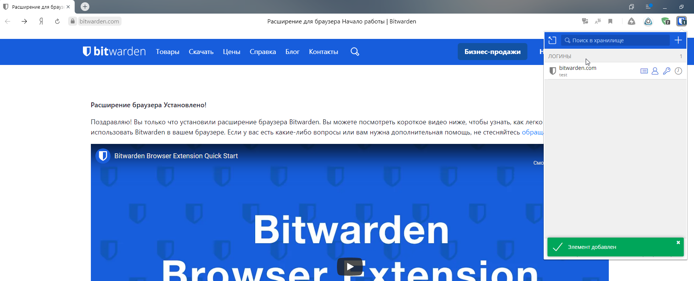
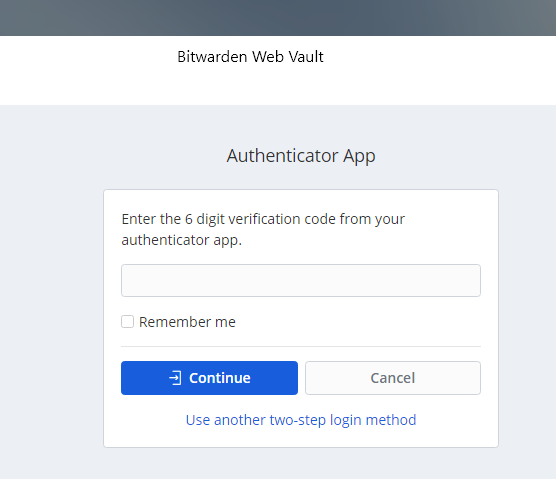
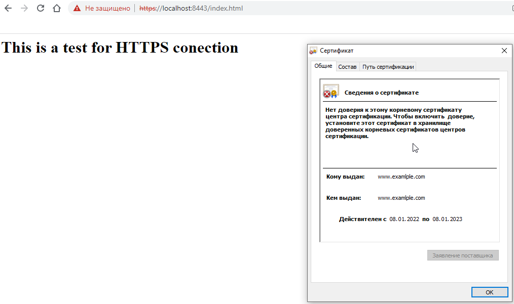
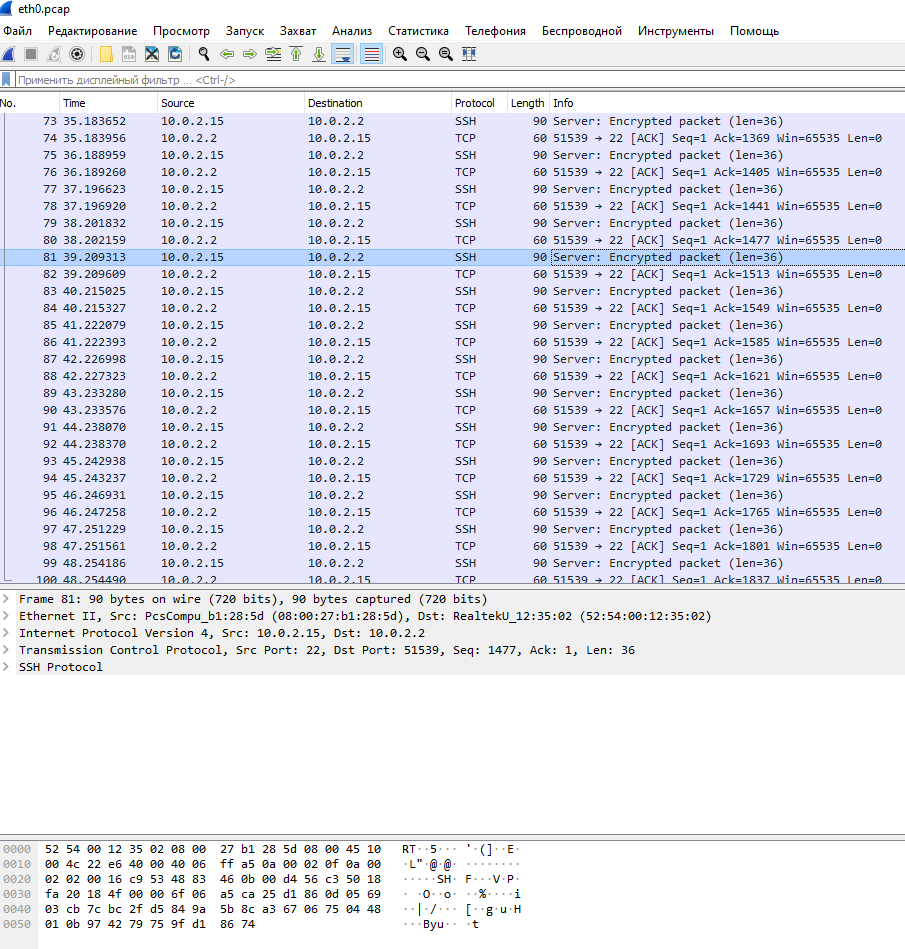

# Домашнее задание к занятию "3.9. Элементы безопасности информационных систем"

##1. Установите Bitwarden плагин для браузера. Зарегестрируйтесь и сохраните несколько паролей.

###Решение:



##2. Установите Google authenticator на мобильный телефон. Настройте вход в Bitwarden акаунт через Google authenticator OTP.

###Решение:



##3. Установите apache2, сгенерируйте самоподписанный сертификат, настройте тестовый сайт для работы по HTTPS.

###Решение:



##4. Проверьте на TLS уязвимости произвольный сайт в интернете (кроме сайтов МВД, ФСБ, МинОбр, НацБанк, РосКосмос, РосАтом, РосНАНО и любых госкомпаний, объектов КИИ, ВПК ... и тому подобное).

###Решение:
```
vagrant@vagrant:~$ sudo nmap -A mail.pivtorg42.ru
Starting Nmap 7.80 ( https://nmap.org ) at 2022-05-23 12:10 UTC
Stats: 0:00:29 elapsed; 0 hosts completed (1 up), 1 undergoing Service Scan
Service scan Timing: About 47.06% done; ETC: 12:10 (0:00:16 remaining)
Stats: 0:00:36 elapsed; 0 hosts completed (1 up), 1 undergoing Service Scan
Service scan Timing: About 52.94% done; ETC: 12:10 (0:00:19 remaining)
Stats: 0:01:29 elapsed; 0 hosts completed (1 up), 1 undergoing Service Scan
Service scan Timing: About 88.24% done; ETC: 12:11 (0:00:10 remaining)
Stats: 0:01:30 elapsed; 0 hosts completed (1 up), 1 undergoing Service Scan
Service scan Timing: About 88.24% done; ETC: 12:11 (0:00:10 remaining)
Stats: 0:02:16 elapsed; 0 hosts completed (1 up), 1 undergoing Service Scan
Service scan Timing: About 94.12% done; ETC: 12:12 (0:00:08 remaining)
Nmap scan report for mail.pivtorg42.ru (212.75.220.18)
Host is up (0.00048s latency).
Not shown: 983 filtered ports
PORT     STATE SERVICE         VERSION
53/tcp   open  domain          (generic dns response: NOTIMP)
143/tcp  open  imap            Microsoft Exchange 2007-2010 imapd
|_imap-capabilities: IDLE MOVE CAPABILITY OK NAMESPACE completed ID UIDPLUS SASL-IR CHILDREN IMAP4 UNSELECT STARTTLS LOGINDISABLED LITERAL+A0001 IMAP4rev1
| imap-ntlm-info:
|   Target_Name: ADM
|   NetBIOS_Domain_Name: ADM
|   NetBIOS_Computer_Name: EX01
|   DNS_Domain_Name: adm.local
|   DNS_Computer_Name: ex01.adm.local
|   DNS_Tree_Name: adm.local
|_  Product_Version: 10.0.17763
| ssl-cert: Subject: commonName=mail.pivtorg42.ru/organizationName=adm/stateOrProvinceName=\xD0\x9A\xD0\xB5\xD0\xBC\xD0\xB5\xD1\x80\xD0\xBE\xD0\xB2\xD1\x81\xD0\xBA\xD0\xB0\xD1\x8F/countryName=RU
| Subject Alternative Name: DNS:mail.pivtorg42.ru, DNS:ex01.adm.local, DNS:AutoDiscover.adm.local, DNS:AutoDiscover.dionis42.ru, DNS:AutoDiscover.pivtorg42.ru, DNS:AutoDiscover.selutina42.ru, DNS:AutoDiscover.evstifeeva42.ru, DNS:AutoDiscover.alcotrade42.ru, DNS:AutoDiscover.pivnoydvor.com, DNS:AutoDiscover.ipevstifeeva.ru, DNS:AutoDiscover.Pivo1.ru, DNS:AutoDiscover.merry42.ru, DNS:AutoDiscover.NBP42.RU, DNS:ex01, DNS:adm.local, DNS:dionis42.ru, DNS:pivtorg42.ru, DNS:selutina42.ru, DNS:evstifeeva42.ru, DNS:alcotrade42.ru, DNS:pivnoydvor.com, DNS:ipevstifeeva.ru, DNS:Pivo1.ru, DNS:merry42.ru, DNS:NBP42.RU
| Not valid before: 2021-03-03T01:48:26
|_Not valid after:  2023-03-03T01:48:26
465/tcp  open  smtp            Microsoft Exchange smtpd
| smtp-commands: ex01.adm.local Hello [158.46.96.191], SIZE 52428800, PIPELINING, DSN, ENHANCEDSTATUSCODES, STARTTLS, X-ANONYMOUSTLS, AUTH GSSAPI NTLM, X-EXPS GSSAPI NTLM, 8BITMIME, BINARYMIME, CHUNKING, XEXCH50, SMTPUTF8, XRDST, XSHADOWREQUEST,
|_ This server supports the following commands: HELO EHLO STARTTLS RCPT DATA RSET MAIL QUIT HELP AUTH BDAT
| smtp-ntlm-info:
|   Target_Name: ADM
|   NetBIOS_Domain_Name: ADM
|   NetBIOS_Computer_Name: EX01
|   DNS_Domain_Name: adm.local
|   DNS_Computer_Name: ex01.adm.local
|   DNS_Tree_Name: adm.local
|_  Product_Version: 10.0.17763
| ssl-cert: Subject: commonName=mail.pivtorg42.ru/organizationName=adm/stateOrProvinceName=\xD0\x9A\xD0\xB5\xD0\xBC\xD0\xB5\xD1\x80\xD0\xBE\xD0\xB2\xD1\x81\xD0\xBA\xD0\xB0\xD1\x8F/countryName=RU
| Subject Alternative Name: DNS:mail.pivtorg42.ru, DNS:ex01.adm.local, DNS:AutoDiscover.adm.local, DNS:AutoDiscover.dionis42.ru, DNS:AutoDiscover.pivtorg42.ru, DNS:AutoDiscover.selutina42.ru, DNS:AutoDiscover.evstifeeva42.ru, DNS:AutoDiscover.alcotrade42.ru, DNS:AutoDiscover.pivnoydvor.com, DNS:AutoDiscover.ipevstifeeva.ru, DNS:AutoDiscover.Pivo1.ru, DNS:AutoDiscover.merry42.ru, DNS:AutoDiscover.NBP42.RU, DNS:ex01, DNS:adm.local, DNS:dionis42.ru, DNS:pivtorg42.ru, DNS:selutina42.ru, DNS:evstifeeva42.ru, DNS:alcotrade42.ru, DNS:pivnoydvor.com, DNS:ipevstifeeva.ru, DNS:Pivo1.ru, DNS:merry42.ru, DNS:NBP42.RU
| Not valid before: 2021-03-03T01:48:26
|_Not valid after:  2023-03-03T01:48:26
587/tcp  open  smtp            Microsoft Exchange smtpd
| smtp-commands: mail.pivtorg42.ru Hello [158.46.96.191], SIZE 52428800, PIPELINING, DSN, ENHANCEDSTATUSCODES, STARTTLS, AUTH GSSAPI NTLM LOGIN, 8BITMIME, BINARYMIME, CHUNKING, SMTPUTF8,
|_ This server supports the following commands: HELO EHLO STARTTLS RCPT DATA RSET MAIL QUIT HELP AUTH BDAT
| smtp-ntlm-info:
|   Target_Name: ADM
|   NetBIOS_Domain_Name: ADM
|   NetBIOS_Computer_Name: EX01
|   DNS_Domain_Name: adm.local
|   DNS_Computer_Name: ex01.adm.local
|   DNS_Tree_Name: adm.local
|_  Product_Version: 10.0.17763
| ssl-cert: Subject: commonName=mail.pivtorg42.ru/organizationName=adm/stateOrProvinceName=\xD0\x9A\xD0\xB5\xD0\xBC\xD0\xB5\xD1\x80\xD0\xBE\xD0\xB2\xD1\x81\xD0\xBA\xD0\xB0\xD1\x8F/countryName=RU
| Subject Alternative Name: DNS:mail.pivtorg42.ru, DNS:ex01.adm.local, DNS:AutoDiscover.adm.local, DNS:AutoDiscover.dionis42.ru, DNS:AutoDiscover.pivtorg42.ru, DNS:AutoDiscover.selutina42.ru, DNS:AutoDiscover.evstifeeva42.ru, DNS:AutoDiscover.alcotrade42.ru, DNS:AutoDiscover.pivnoydvor.com, DNS:AutoDiscover.ipevstifeeva.ru, DNS:AutoDiscover.Pivo1.ru, DNS:AutoDiscover.merry42.ru, DNS:AutoDiscover.NBP42.RU, DNS:ex01, DNS:adm.local, DNS:dionis42.ru, DNS:pivtorg42.ru, DNS:selutina42.ru, DNS:evstifeeva42.ru, DNS:alcotrade42.ru, DNS:pivnoydvor.com, DNS:ipevstifeeva.ru, DNS:Pivo1.ru, DNS:merry42.ru, DNS:NBP42.RU
| Not valid before: 2021-03-03T01:48:26
|_Not valid after:  2023-03-03T01:48:26
1126/tcp open  hpvmmdata?
2525/tcp open  smtp            Microsoft Exchange smtpd
| smtp-commands: ex01.adm.local Hello [158.46.96.191], SIZE, PIPELINING, DSN, ENHANCEDSTATUSCODES, STARTTLS, X-ANONYMOUSTLS, AUTH NTLM, X-EXPS GSSAPI NTLM, 8BITMIME, BINARYMIME, CHUNKING, XEXCH50, SMTPUTF8, XRDST, XSHADOWREQUEST,
|_ This server supports the following commands: HELO EHLO STARTTLS RCPT DATA RSET MAIL QUIT HELP AUTH BDAT
| smtp-ntlm-info:
|   Target_Name: ADM
|   NetBIOS_Domain_Name: ADM
|   NetBIOS_Computer_Name: EX01
|   DNS_Domain_Name: adm.local
|   DNS_Computer_Name: ex01.adm.local
|   DNS_Tree_Name: adm.local
|_  Product_Version: 10.0.17763
| ssl-cert: Subject: commonName=mail.pivtorg42.ru/organizationName=adm/stateOrProvinceName=\xD0\x9A\xD0\xB5\xD0\xBC\xD0\xB5\xD1\x80\xD0\xBE\xD0\xB2\xD1\x81\xD0\xBA\xD0\xB0\xD1\x8F/countryName=RU
| Subject Alternative Name: DNS:mail.pivtorg42.ru, DNS:ex01.adm.local, DNS:AutoDiscover.adm.local, DNS:AutoDiscover.dionis42.ru, DNS:AutoDiscover.pivtorg42.ru, DNS:AutoDiscover.selutina42.ru, DNS:AutoDiscover.evstifeeva42.ru, DNS:AutoDiscover.alcotrade42.ru, DNS:AutoDiscover.pivnoydvor.com, DNS:AutoDiscover.ipevstifeeva.ru, DNS:AutoDiscover.Pivo1.ru, DNS:AutoDiscover.merry42.ru, DNS:AutoDiscover.NBP42.RU, DNS:ex01, DNS:adm.local, DNS:dionis42.ru, DNS:pivtorg42.ru, DNS:selutina42.ru, DNS:evstifeeva42.ru, DNS:alcotrade42.ru, DNS:pivnoydvor.com, DNS:ipevstifeeva.ru, DNS:Pivo1.ru, DNS:merry42.ru, DNS:NBP42.RU
| Not valid before: 2021-03-03T01:48:26
|_Not valid after:  2023-03-03T01:48:26
4444/tcp open  hadoop-datanode Apache Hadoop
| hadoop-datanode-info:
|_  Logs: logout()
| hadoop-tasktracker-info:
|_  Logs: logout()
| http-title: MikroTik SwOS
|_Requested resource was /index.html
|_http-trane-info: Problem with XML parsing of /evox/about
5000/tcp open  http            nginx
| http-robots.txt: 1 disallowed entry
|_/
|_http-title: FTP&nbsp;-&nbsp;Synology&nbsp;DiskStation
5222/tcp open  jabber
| fingerprint-strings:
|   RPCCheck:
|_    <stream:error xmlns:stream="http://etherx.jabber.org/streams"><not-well-formed xmlns="urn:ietf:params:xml:ns:xmpp-streams"/></stream:error></stream:stream>
|_ssl-cert: ERROR: Script execution failed (use -d to debug)
| xmpp-info:
|   STARTTLS Failed
|   info:
|     xmpp:
|       version: 1.0
|     capabilities:
|
|     stream_id: v4d2uh850
|     errors:
|       invalid-namespace
|       (timeout)
|     compression_methods:
|
|     features:
|
|     auth_mechanisms:
|
|_    unknown:
8000/tcp open  http            Microsoft IIS httpd 10.0
| http-methods:
|_  Potentially risky methods: TRACE
|_http-open-proxy: Proxy might be redirecting requests
|_http-server-header: Microsoft-IIS/10.0
|_http-title: IIS Windows Server
8291/tcp open  unknown
9001/tcp open  ssl/tor-orport?
| ssl-cert: Subject: commonName=Server1C.adm.local
| Not valid before: 2022-05-07T20:19:55
|_Not valid after:  2022-11-06T20:19:55
|_ssl-date: 2022-05-23T12:13:57+00:00; +15s from scanner time.
9002/tcp open  ssl/http        Microsoft IIS httpd 10.0
| http-methods:
|_  Potentially risky methods: TRACE
|_http-server-header: Microsoft-IIS/10.0
|_http-title: IIS Windows Server
| ssl-cert: Subject: commonName=web-rdp.adm.local/organizationName=adm/stateOrProvinceName=\xD0\x9A\xD0\xB5\xD0\xBC\xD0\xB5\xD1\x80\xD0\xBE\xD0\xB2\xD1\x81\xD0\xBA\xD0\xB0\xD1\x8F/countryName=RU
| Not valid before: 2020-07-22T02:53:18
|_Not valid after:  2022-07-22T02:53:18
|_ssl-date: 2022-05-23T12:13:57+00:00; +15s from scanner time.
| tls-alpn:
|_  http/1.1
9050/tcp open  ms-wbt-server   Microsoft Terminal Services
| rdp-ntlm-info:
|   Target_Name: PIVNOYDVOR
|   NetBIOS_Domain_Name: PIVNOYDVOR
|   NetBIOS_Computer_Name: BIZANALITIK2
|   DNS_Domain_Name: pivnoydvor.local
|   DNS_Computer_Name: BIZANALITIK2.pivnoydvor.local
|   DNS_Tree_Name: pivnoydvor.local
|   Product_Version: 10.0.19041
|_  System_Time: 2022-05-23T12:13:27+00:00
| ssl-cert: Subject: commonName=BIZANALITIK2.pivnoydvor.local
| Not valid before: 2022-01-22T11:56:17
|_Not valid after:  2022-07-24T11:56:17
|_ssl-date: 2022-05-23T12:13:56+00:00; +14s from scanner time.
9090/tcp open  ms-wbt-server   Microsoft Terminal Services
| rdp-ntlm-info:
|   Target_Name: PIVNOYDVOR
|   NetBIOS_Domain_Name: PIVNOYDVOR
|   NetBIOS_Computer_Name: DIRASU
|   DNS_Domain_Name: pivnoydvor.local
|   DNS_Computer_Name: DIRASU.pivnoydvor.local
|   DNS_Tree_Name: pivnoydvor.local
|   Product_Version: 10.0.19041
|_  System_Time: 2022-05-23T12:13:28+00:00
| ssl-cert: Subject: commonName=DIRASU.pivnoydvor.local
| Not valid before: 2022-04-04T07:58:40
|_Not valid after:  2022-10-04T07:58:40
|_ssl-date: 2022-05-23T12:13:56+00:00; +14s from scanner time.
9998/tcp open  ftp
| fingerprint-strings:
|   GenericLines:
|     220 FTP FTP server ready.
|     command not understood.
|     command not understood.
|   Help:
|     220 FTP FTP server ready.
|     214- The following commands are recognized (* =>'s unimplemented).
|     USER LPRT MODE MSOM* RNTO SITE RMD SIZE AUTH
|     PASS EPRT RETR MSAM* ABOR SYST XRMD MDTM PBSZ
|     ACCT* PASV STOR MRSQ* DELE STAT PWD MLST PROT
|     SMNT* LPSV APPE MRCP* CWD HELP XPWD MLSD CCC
|     REIN* EPSV MLFL* ALLO XCWD NOOP CDUP MFMT
|     QUIT TYPE MAIL* REST LIST MKD XCUP FEAT
|     PORT STRU MSND* RNFR NLST XMKD STOU OPTS
|     Direct comments to ftp-bugs@FTP.
|   NULL, SMBProgNeg:
|     220 FTP FTP server ready.
|   SSLSessionReq:
|     220 FTP FTP server ready.
|_    command not understood.
9999/tcp open  http            Microsoft IIS httpd 10.0
| http-methods:
|_  Potentially risky methods: TRACE
|_http-server-header: Microsoft-IIS/10.0
|_http-title: IIS Windows Server
3 services unrecognized despite returning data. If you know the service/version, please submit the following fingerprints at https://nmap.org/cgi-bin/submit.cgi?new-service :
==============NEXT SERVICE FINGERPRINT (SUBMIT INDIVIDUALLY)==============
SF-Port53-TCP:V=7.80%I=7%D=5/23%Time=628B79B5%P=x86_64-pc-linux-gnu%r(DNSV
SF:ersionBindReqTCP,E,"\0\x0c\0\x06\x81\x84\0\0\0\0\0\0\0\0")%r(DNSStatusR
SF:equestTCP,E,"\0\x0c\0\0\x90\x84\0\0\0\0\0\0\0\0");
==============NEXT SERVICE FINGERPRINT (SUBMIT INDIVIDUALLY)==============
SF-Port5222-TCP:V=7.80%I=7%D=5/23%Time=628B79C4%P=x86_64-pc-linux-gnu%r(RP
SF:CCheck,9B,"<stream:error\x20xmlns:stream=\"http://etherx\.jabber\.org/s
SF:treams\"><not-well-formed\x20xmlns=\"urn:ietf:params:xml:ns:xmpp-stream
SF:s\"/></stream:error></stream:stream>");
==============NEXT SERVICE FINGERPRINT (SUBMIT INDIVIDUALLY)==============
SF-Port9998-TCP:V=7.80%I=7%D=5/23%Time=628B79B0%P=x86_64-pc-linux-gnu%r(NU
SF:LL,1B,"220\x20FTP\x20FTP\x20server\x20ready\.\r\n")%r(GenericLines,59,"
SF:220\x20FTP\x20FTP\x20server\x20ready\.\r\n500\x20:\x20command\x20not\x2
SF:0understood\.\r\n500\x20:\x20command\x20not\x20understood\.\r\n")%r(Hel
SF:p,272,"220\x20FTP\x20FTP\x20server\x20ready\.\r\n214-\x20The\x20followi
SF:ng\x20commands\x20are\x20recognized\x20\(\*\x20=>'s\x20unimplemented\)\
SF:.\r\n\x20\x20\x20USER\x20\x20\x20\x20LPRT\x20\x20\x20\x20MODE\x20\x20\x
SF:20\x20MSOM\*\x20\x20\x20RNTO\x20\x20\x20\x20SITE\x20\x20\x20\x20RMD\x20
SF:\x20\x20\x20\x20SIZE\x20\x20\x20\x20AUTH\x20\r\n\x20\x20\x20PASS\x20\x2
SF:0\x20\x20EPRT\x20\x20\x20\x20RETR\x20\x20\x20\x20MSAM\*\x20\x20\x20ABOR
SF:\x20\x20\x20\x20SYST\x20\x20\x20\x20XRMD\x20\x20\x20\x20MDTM\x20\x20\x2
SF:0\x20PBSZ\x20\r\n\x20\x20\x20ACCT\*\x20\x20\x20PASV\x20\x20\x20\x20STOR
SF:\x20\x20\x20\x20MRSQ\*\x20\x20\x20DELE\x20\x20\x20\x20STAT\x20\x20\x20\
SF:x20PWD\x20\x20\x20\x20\x20MLST\x20\x20\x20\x20PROT\x20\r\n\x20\x20\x20S
SF:MNT\*\x20\x20\x20LPSV\x20\x20\x20\x20APPE\x20\x20\x20\x20MRCP\*\x20\x20
SF:\x20CWD\x20\x20\x20\x20\x20HELP\x20\x20\x20\x20XPWD\x20\x20\x20\x20MLSD
SF:\x20\x20\x20\x20CCC\x20\r\n\x20\x20\x20REIN\*\x20\x20\x20EPSV\x20\x20\x
SF:20\x20MLFL\*\x20\x20\x20ALLO\x20\x20\x20\x20XCWD\x20\x20\x20\x20NOOP\x2
SF:0\x20\x20\x20CDUP\x20\x20\x20\x20MFMT\x20\r\n\x20\x20\x20QUIT\x20\x20\x
SF:20\x20TYPE\x20\x20\x20\x20MAIL\*\x20\x20\x20REST\x20\x20\x20\x20LIST\x2
SF:0\x20\x20\x20MKD\x20\x20\x20\x20\x20XCUP\x20\x20\x20\x20FEAT\x20\r\n\x2
SF:0\x20\x20PORT\x20\x20\x20\x20STRU\x20\x20\x20\x20MSND\*\x20\x20\x20RNFR
SF:\x20\x20\x20\x20NLST\x20\x20\x20\x20XMKD\x20\x20\x20\x20STOU\x20\x20\x2
SF:0\x20OPTS\x20\r\n214\x20Direct\x20comments\x20to\x20ftp-bugs@FTP\.\r\n"
SF:)%r(SSLSessionReq,3C,"220\x20FTP\x20FTP\x20server\x20ready\.\r\n500\x20
SF:\x16\x03:\x20command\x20not\x20understood\.\r\n")%r(SMBProgNeg,1B,"220\
SF:x20FTP\x20FTP\x20server\x20ready\.\r\n");
Warning: OSScan results may be unreliable because we could not find at least 1 open and 1 closed port
Device type: bridge|general purpose
Running (JUST GUESSING): Oracle Virtualbox (98%), QEMU (93%)
OS CPE: cpe:/o:oracle:virtualbox cpe:/a:qemu:qemu
Aggressive OS guesses: Oracle Virtualbox (98%), QEMU user mode network gateway (93%)
No exact OS matches for host (test conditions non-ideal).
Network Distance: 2 hops
Service Info: Host: ex01.adm.local; OS: Windows; Device: router; CPE: cpe:/o:microsoft:windows, cpe:/h:mikrotik:routerboard_250gs

Host script results:
|_clock-skew: mean: 14s, deviation: 0s, median: 13s

TRACEROUTE (using port 80/tcp)
HOP RTT     ADDRESS
1   0.26 ms 10.0.2.2
2   0.25 ms mail.pivtorg42.ru (212.75.220.18)

OS and Service detection performed. Please report any incorrect results at https://nmap.org/submit/ .
Nmap done: 1 IP address (1 host up) scanned in 220.22 seconds
```

##5. Установите на Ubuntu ssh сервер, сгенерируйте новый приватный ключ. Скопируйте свой публичный ключ на другой сервер. Подключитесь к серверу по SSH-ключу.

###Решение:
```
login as: skelin_ei
Authenticating with public key "rsa-key-20220523"
Last login: Mon May 23 19:41:45 2022 from 10.50.10.106
[skelin_ei@1c-lic-okunevo ~]$

```

###6. Переименуйте файлы ключей из задания 5. Настройте файл конфигурации SSH клиента, так чтобы вход на удаленный сервер осуществлялся по имени сервера.
При нормальной работе DNS и так можно подключаться по имени сервера. Дополнительная настройка ssh не требуется.

##7. Соберите дамп трафика утилитой tcpdump в формате pcap, 100 пакетов. Откройте файл pcap в Wireshark.

###Решение:
