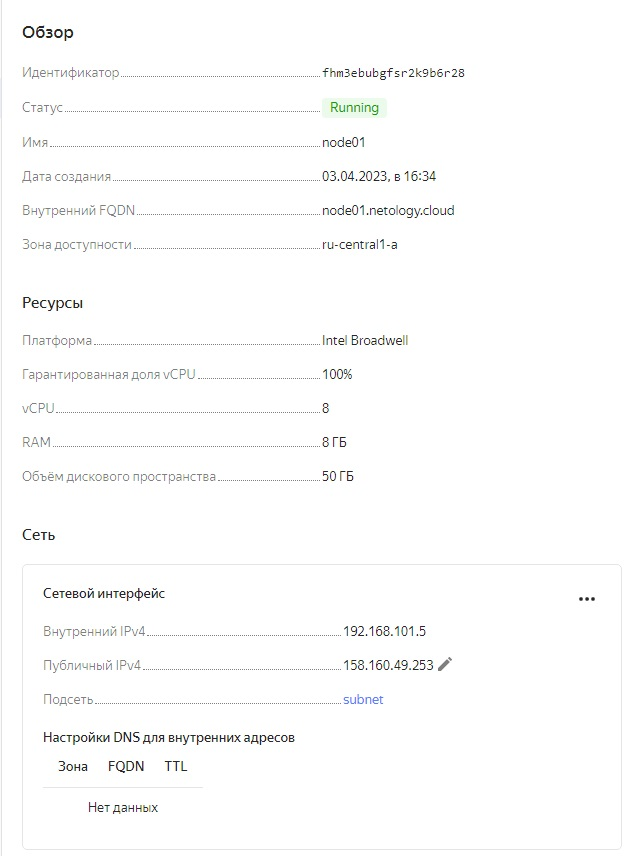

# Домашнее задание к занятию "5.4. Оркестрация группой Docker контейнеров на примере Docker Compose".
## Задача 1
Создать собственный образ операционной системы с помощью Packer.

Для получения зачета, вам необходимо предоставить:

* Скриншот страницы, как на слайде из презентации (слайд 37).

### Решение:
```shell
ubuntu@aerokuz-001:/mnt/c/Users/skelin_ei/git/devops-netology/packer$ packer build ./sentos7.json
yandex: output will be in this color.

==> yandex: Creating temporary RSA SSH key for instance...
==> yandex: Using as source image: fd8jvcoeij6u9se84dt5 (name: "centos-7-v20221121", family: "centos-7")
==> yandex: Use provided subnet id e9bh13f7oi3blud58o6f
==> yandex: Creating disk...
==> yandex: Creating instance...
==> yandex: Waiting for instance with id fhmp01c4nrrpolcpli3c to become active...
    yandex: Detected instance IP: 158.160.55.84
==> yandex: Using SSH communicator to connect: 158.160.55.84
==> yandex: Waiting for SSH to become available...
==> yandex: Connected to SSH!
==> yandex: Provisioning with shell script: /tmp/packer-shell2941672201
    yandex: Loaded plugins: fastestmirror
    yandex: Determining fastest mirrors
    yandex:  * base: mirror.docker.ru
    yandex:  * extras: mirror.docker.ru
    yandex:  * updates: mirror.sale-dedic.com
    yandex: Resolving Dependencies
    yandex: --> Running transaction check
    yandex: ---> Package bind-export-libs.x86_64 32:9.11.4-26.P2.el7_9.10 will be updated
    yandex: ---> Package bind-export-libs.x86_64 32:9.11.4-26.P2.el7_9.13 will be an update
    yandex: ---> Package diffutils.x86_64 0:3.3-5.el7 will be updated
    yandex: ---> Package diffutils.x86_64 0:3.3-6.el7_9 will be an update
    yandex: ---> Package grub2.x86_64 1:2.02-0.87.0.1.el7.centos.9 will be updated
    yandex: ---> Package grub2.x86_64 1:2.02-0.87.0.2.el7.centos.11 will be an update
    yandex: ---> Package grub2-common.noarch 1:2.02-0.87.0.1.el7.centos.9 will be updated
    yandex: ---> Package grub2-common.noarch 1:2.02-0.87.0.2.el7.centos.11 will be an update
    yandex: ---> Package grub2-pc.x86_64 1:2.02-0.87.0.1.el7.centos.9 will be updated
    yandex: ---> Package grub2-pc.x86_64 1:2.02-0.87.0.2.el7.centos.11 will be an update
    yandex: ---> Package grub2-pc-modules.noarch 1:2.02-0.87.0.1.el7.centos.9 will be updated
    yandex: ---> Package grub2-pc-modules.noarch 1:2.02-0.87.0.2.el7.centos.11 will be an update
    yandex: ---> Package grub2-tools.x86_64 1:2.02-0.87.0.1.el7.centos.9 will be updated
    yandex: ---> Package grub2-tools.x86_64 1:2.02-0.87.0.2.el7.centos.11 will be an update
    yandex: ---> Package grub2-tools-extra.x86_64 1:2.02-0.87.0.1.el7.centos.9 will be updated
    yandex: ---> Package grub2-tools-extra.x86_64 1:2.02-0.87.0.2.el7.centos.11 will be an update
    yandex: ---> Package grub2-tools-minimal.x86_64 1:2.02-0.87.0.1.el7.centos.9 will be updated
    yandex: ---> Package grub2-tools-minimal.x86_64 1:2.02-0.87.0.2.el7.centos.11 will be an update
    yandex: ---> Package kernel.x86_64 0:3.10.0-1160.88.1.el7 will be installed
    yandex: ---> Package kernel-tools.x86_64 0:3.10.0-1160.80.1.el7 will be updated
    yandex: ---> Package kernel-tools.x86_64 0:3.10.0-1160.88.1.el7 will be an update
    yandex: ---> Package kernel-tools-libs.x86_64 0:3.10.0-1160.80.1.el7 will be updated
    yandex: ---> Package kernel-tools-libs.x86_64 0:3.10.0-1160.88.1.el7 will be an update
    yandex: ---> Package kpartx.x86_64 0:0.4.9-135.el7_9 will be updated
    yandex: ---> Package kpartx.x86_64 0:0.4.9-136.el7_9 will be an update
    yandex: ---> Package krb5-libs.x86_64 0:1.15.1-54.el7_9 will be updated
    yandex: ---> Package krb5-libs.x86_64 0:1.15.1-55.el7_9 will be an update
    yandex: ---> Package nss.x86_64 0:3.79.0-4.el7_9 will be updated
    yandex: ---> Package nss.x86_64 0:3.79.0-5.el7_9 will be an update
    yandex: ---> Package nss-sysinit.x86_64 0:3.79.0-4.el7_9 will be updated
    yandex: ---> Package nss-sysinit.x86_64 0:3.79.0-5.el7_9 will be an update
    yandex: ---> Package nss-tools.x86_64 0:3.79.0-4.el7_9 will be updated
    yandex: ---> Package nss-tools.x86_64 0:3.79.0-5.el7_9 will be an update
    yandex: ---> Package openssl.x86_64 1:1.0.2k-25.el7_9 will be updated
    yandex: ---> Package openssl.x86_64 1:1.0.2k-26.el7_9 will be an update
    yandex: ---> Package openssl-libs.x86_64 1:1.0.2k-25.el7_9 will be updated
    yandex: ---> Package openssl-libs.x86_64 1:1.0.2k-26.el7_9 will be an update
    yandex: ---> Package python-perf.x86_64 0:3.10.0-1160.80.1.el7 will be updated
    yandex: ---> Package python-perf.x86_64 0:3.10.0-1160.88.1.el7 will be an update
    yandex: ---> Package rsync.x86_64 0:3.1.2-11.el7_9 will be updated
    yandex: ---> Package rsync.x86_64 0:3.1.2-12.el7_9 will be an update
    yandex: ---> Package sudo.x86_64 0:1.8.23-10.el7_9.2 will be updated
    yandex: ---> Package sudo.x86_64 0:1.8.23-10.el7_9.3 will be an update
    yandex: ---> Package tzdata.noarch 0:2022e-1.el7 will be updated
    yandex: ---> Package tzdata.noarch 0:2022g-1.el7 will be an update
    yandex: ---> Package zlib.x86_64 0:1.2.7-20.el7_9 will be updated
    yandex: ---> Package zlib.x86_64 0:1.2.7-21.el7_9 will be an update
    yandex: --> Finished Dependency Resolution
    yandex:
    yandex: Dependencies Resolved
    yandex:
    yandex: ================================================================================
    yandex:  Package               Arch     Version                         Repository
    yandex:                                                                            Size
    yandex: ================================================================================
    yandex: Installing:
    yandex:  kernel                x86_64   3.10.0-1160.88.1.el7            updates    52 M
    yandex: Updating:
    yandex:  bind-export-libs      x86_64   32:9.11.4-26.P2.el7_9.13        updates   1.1 M
    yandex:  diffutils             x86_64   3.3-6.el7_9                     updates   322 k
    yandex:  grub2                 x86_64   1:2.02-0.87.0.2.el7.centos.11   updates    34 k
    yandex:  grub2-common          noarch   1:2.02-0.87.0.2.el7.centos.11   updates   733 k
    yandex:  grub2-pc              x86_64   1:2.02-0.87.0.2.el7.centos.11   updates    34 k
    yandex:  grub2-pc-modules      noarch   1:2.02-0.87.0.2.el7.centos.11   updates   860 k
    yandex:  grub2-tools           x86_64   1:2.02-0.87.0.2.el7.centos.11   updates   1.8 M
    yandex:  grub2-tools-extra     x86_64   1:2.02-0.87.0.2.el7.centos.11   updates   1.0 M
    yandex:  grub2-tools-minimal   x86_64   1:2.02-0.87.0.2.el7.centos.11   updates   177 k
    yandex:  kernel-tools          x86_64   3.10.0-1160.88.1.el7            updates   8.2 M
    yandex:  kernel-tools-libs     x86_64   3.10.0-1160.88.1.el7            updates   8.1 M
    yandex:  kpartx                x86_64   0.4.9-136.el7_9                 updates    81 k
    yandex:  krb5-libs             x86_64   1.15.1-55.el7_9                 updates   810 k
    yandex:  nss                   x86_64   3.79.0-5.el7_9                  updates   895 k
    yandex:  nss-sysinit           x86_64   3.79.0-5.el7_9                  updates    66 k
    yandex:  nss-tools             x86_64   3.79.0-5.el7_9                  updates   555 k
    yandex:  openssl               x86_64   1:1.0.2k-26.el7_9               updates   494 k
    yandex:  openssl-libs          x86_64   1:1.0.2k-26.el7_9               updates   1.2 M
    yandex:  python-perf           x86_64   3.10.0-1160.88.1.el7            updates   8.2 M
    yandex:  rsync                 x86_64   3.1.2-12.el7_9                  updates   408 k
    yandex:  sudo                  x86_64   1.8.23-10.el7_9.3               updates   844 k
    yandex:  tzdata                noarch   2022g-1.el7                     updates   490 k
    yandex:  zlib                  x86_64   1.2.7-21.el7_9                  updates    90 k
    yandex:
    yandex: Transaction Summary
    yandex: ================================================================================
    yandex: Install   1 Package
    yandex: Upgrade  23 Packages
    yandex:
    yandex: Total download size: 88 M
    yandex: Downloading packages:
    yandex: Delta RPMs disabled because /usr/bin/applydeltarpm not installed.
    yandex: --------------------------------------------------------------------------------
    yandex: Total                                               39 MB/s |  88 MB  00:02
    yandex: Running transaction check
    yandex: Running transaction test
    yandex: Transaction test succeeded
    yandex: Running transaction
    yandex:   Updating   : 1:grub2-common-2.02-0.87.0.2.el7.centos.11.noarch           1/47
    yandex:   Updating   : zlib-1.2.7-21.el7_9.x86_64                                  2/47
    yandex:   Updating   : krb5-libs-1.15.1-55.el7_9.x86_64                            3/47
    yandex:   Updating   : 1:openssl-libs-1.0.2k-26.el7_9.x86_64                       4/47
    yandex:   Updating   : 1:grub2-tools-minimal-2.02-0.87.0.2.el7.centos.11.x86_64    5/47
    yandex:   Updating   : 1:grub2-tools-2.02-0.87.0.2.el7.centos.11.x86_64            6/47
    yandex:   Updating   : 1:grub2-tools-extra-2.02-0.87.0.2.el7.centos.11.x86_64      7/47
    yandex:   Updating   : 1:grub2-pc-modules-2.02-0.87.0.2.el7.centos.11.noarch       8/47
    yandex:   Updating   : 1:grub2-pc-2.02-0.87.0.2.el7.centos.11.x86_64               9/47
    yandex:   Updating   : nss-3.79.0-5.el7_9.x86_64                                  10/47
    yandex:   Updating   : nss-sysinit-3.79.0-5.el7_9.x86_64                          11/47
    yandex:   Updating   : kernel-tools-libs-3.10.0-1160.88.1.el7.x86_64              12/47
    yandex:   Updating   : kernel-tools-3.10.0-1160.88.1.el7.x86_64                   13/47
    yandex:   Updating   : nss-tools-3.79.0-5.el7_9.x86_64                            14/47
    yandex:   Updating   : 1:grub2-2.02-0.87.0.2.el7.centos.11.x86_64                 15/47
    yandex:   Updating   : 32:bind-export-libs-9.11.4-26.P2.el7_9.13.x86_64           16/47
    yandex:   Updating   : 1:openssl-1.0.2k-26.el7_9.x86_64                           17/47
    yandex:   Updating   : rsync-3.1.2-12.el7_9.x86_64                                18/47
    yandex:   Updating   : sudo-1.8.23-10.el7_9.3.x86_64                              19/47
    yandex:   Updating   : diffutils-3.3-6.el7_9.x86_64                               20/47
    yandex:   Updating   : tzdata-2022g-1.el7.noarch                                  21/47
    yandex:   Updating   : kpartx-0.4.9-136.el7_9.x86_64                              22/47
    yandex:   Updating   : python-perf-3.10.0-1160.88.1.el7.x86_64                    23/47
    yandex:   Installing : kernel-3.10.0-1160.88.1.el7.x86_64                         24/47
    yandex:   Cleanup    : 1:openssl-1.0.2k-25.el7_9.x86_64                           25/47
    yandex:   Cleanup    : nss-tools-3.79.0-4.el7_9.x86_64                            26/47
    yandex:   Cleanup    : 32:bind-export-libs-9.11.4-26.P2.el7_9.10.x86_64           27/47
    yandex:   Cleanup    : 1:grub2-2.02-0.87.0.1.el7.centos.9.x86_64                  28/47
    yandex:   Cleanup    : 1:grub2-pc-2.02-0.87.0.1.el7.centos.9.x86_64               29/47
    yandex:   Cleanup    : 1:grub2-tools-extra-2.02-0.87.0.1.el7.centos.9.x86_64      30/47
    yandex:   Cleanup    : 1:grub2-tools-2.02-0.87.0.1.el7.centos.9.x86_64            31/47
    yandex:   Cleanup    : krb5-libs-1.15.1-54.el7_9.x86_64                           32/47
    yandex:   Cleanup    : 1:openssl-libs-1.0.2k-25.el7_9.x86_64                      33/47
    yandex:   Cleanup    : 1:grub2-pc-modules-2.02-0.87.0.1.el7.centos.9.noarch       34/47
    yandex:   Cleanup    : 1:grub2-tools-minimal-2.02-0.87.0.1.el7.centos.9.x86_64    35/47
    yandex:   Cleanup    : nss-3.79.0-4.el7_9.x86_64                                  36/47
    yandex:   Cleanup    : nss-sysinit-3.79.0-4.el7_9.x86_64                          37/47
    yandex:   Cleanup    : sudo-1.8.23-10.el7_9.2.x86_64                              38/47
    yandex:   Cleanup    : kernel-tools-3.10.0-1160.80.1.el7.x86_64                   39/47
    yandex:   Cleanup    : rsync-3.1.2-11.el7_9.x86_64                                40/47
    yandex:   Cleanup    : 1:grub2-common-2.02-0.87.0.1.el7.centos.9.noarch           41/47
    yandex:   Cleanup    : tzdata-2022e-1.el7.noarch                                  42/47
    yandex:   Cleanup    : zlib-1.2.7-20.el7_9.x86_64                                 43/47
    yandex:   Cleanup    : kernel-tools-libs-3.10.0-1160.80.1.el7.x86_64              44/47
    yandex:   Cleanup    : diffutils-3.3-5.el7.x86_64                                 45/47
    yandex:   Cleanup    : kpartx-0.4.9-135.el7_9.x86_64                              46/47
    yandex:   Cleanup    : python-perf-3.10.0-1160.80.1.el7.x86_64                    47/47
    yandex:   Verifying  : 1:openssl-libs-1.0.2k-26.el7_9.x86_64                       1/47
    yandex:   Verifying  : nss-sysinit-3.79.0-5.el7_9.x86_64                           2/47
    yandex:   Verifying  : 1:grub2-tools-minimal-2.02-0.87.0.2.el7.centos.11.x86_64    3/47
    yandex:   Verifying  : rsync-3.1.2-12.el7_9.x86_64                                 4/47
    yandex:   Verifying  : 1:grub2-pc-2.02-0.87.0.2.el7.centos.11.x86_64               5/47
    yandex:   Verifying  : 32:bind-export-libs-9.11.4-26.P2.el7_9.13.x86_64            6/47
    yandex:   Verifying  : zlib-1.2.7-21.el7_9.x86_64                                  7/47
    yandex:   Verifying  : kernel-3.10.0-1160.88.1.el7.x86_64                          8/47
    yandex:   Verifying  : python-perf-3.10.0-1160.88.1.el7.x86_64                     9/47
    yandex:   Verifying  : kernel-tools-3.10.0-1160.88.1.el7.x86_64                   10/47
    yandex:   Verifying  : 1:grub2-tools-extra-2.02-0.87.0.2.el7.centos.11.x86_64     11/47
    yandex:   Verifying  : 1:openssl-1.0.2k-26.el7_9.x86_64                           12/47
    yandex:   Verifying  : kpartx-0.4.9-136.el7_9.x86_64                              13/47
    yandex:   Verifying  : nss-3.79.0-5.el7_9.x86_64                                  14/47
    yandex:   Verifying  : sudo-1.8.23-10.el7_9.3.x86_64                              15/47
    yandex:   Verifying  : krb5-libs-1.15.1-55.el7_9.x86_64                           16/47
    yandex:   Verifying  : 1:grub2-pc-modules-2.02-0.87.0.2.el7.centos.11.noarch      17/47
    yandex:   Verifying  : tzdata-2022g-1.el7.noarch                                  18/47
    yandex:   Verifying  : 1:grub2-2.02-0.87.0.2.el7.centos.11.x86_64                 19/47
    yandex:   Verifying  : 1:grub2-tools-2.02-0.87.0.2.el7.centos.11.x86_64           20/47
    yandex:   Verifying  : kernel-tools-libs-3.10.0-1160.88.1.el7.x86_64              21/47
    yandex:   Verifying  : 1:grub2-common-2.02-0.87.0.2.el7.centos.11.noarch          22/47
    yandex:   Verifying  : nss-tools-3.79.0-5.el7_9.x86_64                            23/47
    yandex:   Verifying  : diffutils-3.3-6.el7_9.x86_64                               24/47
    yandex:   Verifying  : 32:bind-export-libs-9.11.4-26.P2.el7_9.10.x86_64           25/47
    yandex:   Verifying  : 1:openssl-1.0.2k-25.el7_9.x86_64                           26/47
    yandex:   Verifying  : 1:grub2-pc-2.02-0.87.0.1.el7.centos.9.x86_64               27/47
    yandex:   Verifying  : kpartx-0.4.9-135.el7_9.x86_64                              28/47
    yandex:   Verifying  : 1:grub2-tools-extra-2.02-0.87.0.1.el7.centos.9.x86_64      29/47
    yandex:   Verifying  : 1:grub2-tools-minimal-2.02-0.87.0.1.el7.centos.9.x86_64    30/47
    yandex:   Verifying  : rsync-3.1.2-11.el7_9.x86_64                                31/47
    yandex:   Verifying  : 1:grub2-common-2.02-0.87.0.1.el7.centos.9.noarch           32/47
    yandex:   Verifying  : 1:grub2-tools-2.02-0.87.0.1.el7.centos.9.x86_64            33/47
    yandex:   Verifying  : nss-sysinit-3.79.0-4.el7_9.x86_64                          34/47
    yandex:   Verifying  : diffutils-3.3-5.el7.x86_64                                 35/47
    yandex:   Verifying  : 1:grub2-2.02-0.87.0.1.el7.centos.9.x86_64                  36/47
    yandex:   Verifying  : 1:grub2-pc-modules-2.02-0.87.0.1.el7.centos.9.noarch       37/47
    yandex:   Verifying  : tzdata-2022e-1.el7.noarch                                  38/47
    yandex:   Verifying  : 1:openssl-libs-1.0.2k-25.el7_9.x86_64                      39/47
    yandex:   Verifying  : python-perf-3.10.0-1160.80.1.el7.x86_64                    40/47
    yandex:   Verifying  : zlib-1.2.7-20.el7_9.x86_64                                 41/47
    yandex:   Verifying  : krb5-libs-1.15.1-54.el7_9.x86_64                           42/47
    yandex:   Verifying  : sudo-1.8.23-10.el7_9.2.x86_64                              43/47
    yandex:   Verifying  : kernel-tools-libs-3.10.0-1160.80.1.el7.x86_64              44/47
    yandex:   Verifying  : nss-tools-3.79.0-4.el7_9.x86_64                            45/47
    yandex:   Verifying  : kernel-tools-3.10.0-1160.80.1.el7.x86_64                   46/47
    yandex:   Verifying  : nss-3.79.0-4.el7_9.x86_64                                  47/47
    yandex:
    yandex: Installed:
    yandex:   kernel.x86_64 0:3.10.0-1160.88.1.el7
    yandex:
    yandex: Updated:
    yandex:   bind-export-libs.x86_64 32:9.11.4-26.P2.el7_9.13
    yandex:   diffutils.x86_64 0:3.3-6.el7_9
    yandex:   grub2.x86_64 1:2.02-0.87.0.2.el7.centos.11
    yandex:   grub2-common.noarch 1:2.02-0.87.0.2.el7.centos.11
    yandex:   grub2-pc.x86_64 1:2.02-0.87.0.2.el7.centos.11
    yandex:   grub2-pc-modules.noarch 1:2.02-0.87.0.2.el7.centos.11
    yandex:   grub2-tools.x86_64 1:2.02-0.87.0.2.el7.centos.11
    yandex:   grub2-tools-extra.x86_64 1:2.02-0.87.0.2.el7.centos.11
    yandex:   grub2-tools-minimal.x86_64 1:2.02-0.87.0.2.el7.centos.11
    yandex:   kernel-tools.x86_64 0:3.10.0-1160.88.1.el7
    yandex:   kernel-tools-libs.x86_64 0:3.10.0-1160.88.1.el7
    yandex:   kpartx.x86_64 0:0.4.9-136.el7_9
    yandex:   krb5-libs.x86_64 0:1.15.1-55.el7_9
    yandex:   nss.x86_64 0:3.79.0-5.el7_9
    yandex:   nss-sysinit.x86_64 0:3.79.0-5.el7_9
    yandex:   nss-tools.x86_64 0:3.79.0-5.el7_9
    yandex:   openssl.x86_64 1:1.0.2k-26.el7_9
    yandex:   openssl-libs.x86_64 1:1.0.2k-26.el7_9
    yandex:   python-perf.x86_64 0:3.10.0-1160.88.1.el7
    yandex:   rsync.x86_64 0:3.1.2-12.el7_9
    yandex:   sudo.x86_64 0:1.8.23-10.el7_9.3
    yandex:   tzdata.noarch 0:2022g-1.el7
    yandex:   zlib.x86_64 0:1.2.7-21.el7_9
    yandex:
    yandex: Complete!
    yandex: Loaded plugins: fastestmirror
    yandex: Loading mirror speeds from cached hostfile
    yandex:  * base: mirror.docker.ru
    yandex:  * extras: mirror.docker.ru
    yandex:  * updates: mirror.sale-dedic.com
    yandex: Package iptables-1.4.21-35.el7.x86_64 already installed and latest version
    yandex: Package curl-7.29.0-59.el7_9.1.x86_64 already installed and latest version
    yandex: Package net-tools-2.0-0.25.20131004git.el7.x86_64 already installed and latest version
    yandex: Package rsync-3.1.2-12.el7_9.x86_64 already installed and latest version
    yandex: Package openssh-server-7.4p1-22.el7_9.x86_64 already installed and latest version
    yandex: Resolving Dependencies
    yandex: --> Running transaction check
    yandex: ---> Package bind-utils.x86_64 32:9.11.4-26.P2.el7_9.13 will be installed
    yandex: --> Processing Dependency: bind-libs-lite(x86-64) = 32:9.11.4-26.P2.el7_9.13 for package: 32:bind-utils-9.11.4-26.P2.el7_9.13.x86_64
    yandex: --> Processing Dependency: bind-libs(x86-64) = 32:9.11.4-26.P2.el7_9.13 for package: 32:bind-utils-9.11.4-26.P2.el7_9.13.x86_64
    yandex: --> Processing Dependency: liblwres.so.160()(64bit) for package: 32:bind-utils-9.11.4-26.P2.el7_9.13.x86_64
    yandex: --> Processing Dependency: libisccfg.so.160()(64bit) for package: 32:bind-utils-9.11.4-26.P2.el7_9.13.x86_64
    yandex: --> Processing Dependency: libisc.so.169()(64bit) for package: 32:bind-utils-9.11.4-26.P2.el7_9.13.x86_64
    yandex: --> Processing Dependency: libirs.so.160()(64bit) for package: 32:bind-utils-9.11.4-26.P2.el7_9.13.x86_64
    yandex: --> Processing Dependency: libdns.so.1102()(64bit) for package: 32:bind-utils-9.11.4-26.P2.el7_9.13.x86_64
    yandex: --> Processing Dependency: libbind9.so.160()(64bit) for package: 32:bind-utils-9.11.4-26.P2.el7_9.13.x86_64
    yandex: --> Processing Dependency: libGeoIP.so.1()(64bit) for package: 32:bind-utils-9.11.4-26.P2.el7_9.13.x86_64
    yandex: ---> Package bridge-utils.x86_64 0:1.5-9.el7 will be installed
    yandex: ---> Package tcpdump.x86_64 14:4.9.2-4.el7_7.1 will be installed
    yandex: --> Processing Dependency: libpcap >= 14:1.5.3-10 for package: 14:tcpdump-4.9.2-4.el7_7.1.x86_64
    yandex: --> Processing Dependency: libpcap.so.1()(64bit) for package: 14:tcpdump-4.9.2-4.el7_7.1.x86_64
    yandex: ---> Package telnet.x86_64 1:0.17-66.el7 will be installed
    yandex: --> Running transaction check
    yandex: ---> Package GeoIP.x86_64 0:1.5.0-14.el7 will be installed
    yandex: --> Processing Dependency: geoipupdate for package: GeoIP-1.5.0-14.el7.x86_64
    yandex: ---> Package bind-libs.x86_64 32:9.11.4-26.P2.el7_9.13 will be installed
    yandex: --> Processing Dependency: bind-license = 32:9.11.4-26.P2.el7_9.13 for package: 32:bind-libs-9.11.4-26.P2.el7_9.13.x86_64
    yandex: ---> Package bind-libs-lite.x86_64 32:9.11.4-26.P2.el7_9.13 will be installed
    yandex: ---> Package libpcap.x86_64 14:1.5.3-13.el7_9 will be installed
    yandex: --> Running transaction check
    yandex: ---> Package bind-license.noarch 32:9.11.4-26.P2.el7_9.13 will be installed
    yandex: ---> Package geoipupdate.x86_64 0:2.5.0-1.el7 will be installed
    yandex: --> Finished Dependency Resolution
    yandex:
    yandex: Dependencies Resolved
    yandex:
    yandex: ================================================================================
    yandex:  Package            Arch       Version                        Repository   Size
    yandex: ================================================================================
    yandex: Installing:
    yandex:  bind-utils         x86_64     32:9.11.4-26.P2.el7_9.13       updates     262 k
    yandex:  bridge-utils       x86_64     1.5-9.el7                      base         32 k
    yandex:  tcpdump            x86_64     14:4.9.2-4.el7_7.1             base        422 k
    yandex:  telnet             x86_64     1:0.17-66.el7                  updates      64 k
    yandex: Installing for dependencies:
    yandex:  GeoIP              x86_64     1.5.0-14.el7                   base        1.5 M
    yandex:  bind-libs          x86_64     32:9.11.4-26.P2.el7_9.13       updates     158 k
    yandex:  bind-libs-lite     x86_64     32:9.11.4-26.P2.el7_9.13       updates     1.1 M
    yandex:  bind-license       noarch     32:9.11.4-26.P2.el7_9.13       updates      92 k
    yandex:  geoipupdate        x86_64     2.5.0-1.el7                    base         35 k
    yandex:  libpcap            x86_64     14:1.5.3-13.el7_9              updates     139 k
    yandex:
    yandex: Transaction Summary
    yandex: ================================================================================
    yandex: Install  4 Packages (+6 Dependent packages)
    yandex:
    yandex: Total download size: 3.8 M
    yandex: Installed size: 9.0 M
    yandex: Downloading packages:
    yandex: --------------------------------------------------------------------------------
    yandex: Total                                              6.9 MB/s | 3.8 MB  00:00
    yandex: Running transaction check
    yandex: Running transaction test
    yandex: Transaction test succeeded
    yandex: Running transaction
    yandex:   Installing : 32:bind-license-9.11.4-26.P2.el7_9.13.noarch                1/10
    yandex:   Installing : geoipupdate-2.5.0-1.el7.x86_64                              2/10
    yandex:   Installing : GeoIP-1.5.0-14.el7.x86_64                                   3/10
    yandex:   Installing : 32:bind-libs-lite-9.11.4-26.P2.el7_9.13.x86_64              4/10
    yandex:   Installing : 32:bind-libs-9.11.4-26.P2.el7_9.13.x86_64                   5/10
    yandex:   Installing : 14:libpcap-1.5.3-13.el7_9.x86_64                            6/10
    yandex: pam_tally2: Error opening /var/log/tallylog for update: Permission denied
    yandex: pam_tally2: Authentication error
    yandex: useradd: failed to reset the tallylog entry of user "tcpdump"
    yandex:   Installing : 14:tcpdump-4.9.2-4.el7_7.1.x86_64                           7/10
    yandex:   Installing : 32:bind-utils-9.11.4-26.P2.el7_9.13.x86_64                  8/10
    yandex:   Installing : bridge-utils-1.5-9.el7.x86_64                               9/10
    yandex:   Installing : 1:telnet-0.17-66.el7.x86_64                                10/10
    yandex:   Verifying  : GeoIP-1.5.0-14.el7.x86_64                                   1/10
    yandex:   Verifying  : 14:libpcap-1.5.3-13.el7_9.x86_64                            2/10
    yandex:   Verifying  : 1:telnet-0.17-66.el7.x86_64                                 3/10
    yandex:   Verifying  : 32:bind-license-9.11.4-26.P2.el7_9.13.noarch                4/10
    yandex:   Verifying  : geoipupdate-2.5.0-1.el7.x86_64                              5/10
    yandex:   Verifying  : 14:tcpdump-4.9.2-4.el7_7.1.x86_64                           6/10
    yandex:   Verifying  : 32:bind-utils-9.11.4-26.P2.el7_9.13.x86_64                  7/10
    yandex:   Verifying  : 32:bind-libs-lite-9.11.4-26.P2.el7_9.13.x86_64              8/10
    yandex:   Verifying  : 32:bind-libs-9.11.4-26.P2.el7_9.13.x86_64                   9/10
    yandex:   Verifying  : bridge-utils-1.5-9.el7.x86_64                              10/10
    yandex:
    yandex: Installed:
    yandex:   bind-utils.x86_64 32:9.11.4-26.P2.el7_9.13   bridge-utils.x86_64 0:1.5-9.el7
    yandex:   tcpdump.x86_64 14:4.9.2-4.el7_7.1            telnet.x86_64 1:0.17-66.el7
    yandex:
    yandex: Dependency Installed:
    yandex:   GeoIP.x86_64 0:1.5.0-14.el7
    yandex:   bind-libs.x86_64 32:9.11.4-26.P2.el7_9.13
    yandex:   bind-libs-lite.x86_64 32:9.11.4-26.P2.el7_9.13
    yandex:   bind-license.noarch 32:9.11.4-26.P2.el7_9.13
    yandex:   geoipupdate.x86_64 0:2.5.0-1.el7
    yandex:   libpcap.x86_64 14:1.5.3-13.el7_9
    yandex:
    yandex: Complete!
==> yandex: Stopping instance...
==> yandex: Deleting instance...
    yandex: Instance has been deleted!
==> yandex: Creating image: centos-7-base
==> yandex: Waiting for image to complete...
==> yandex: Success image create...
==> yandex: Destroying boot disk...
    yandex: Disk has been deleted!
Build 'yandex' finished after 5 minutes 2 seconds.

==> Wait completed after 5 minutes 2 seconds

==> Builds finished. The artifacts of successful builds are:
--> yandex: A disk image was created: centos-7-base (id: fd83ce1ulffa1o5mgbvs) with family name centos
ubuntu@aerokuz-001:/mnt/c/Users/skelin_ei/git/devops-netology/packer$ yc compute image list
variable "centos-7-base

+----------------------+---------------+--------+----------------------+--------+
|          ID          |     NAME      | FAMILY |     PRODUCT IDS      | STATUS |
+----------------------+---------------+--------+----------------------+--------+
| fd83ce1ulffa1o5mgbvs | centos-7-base | centos | f2ei2tsbd97v7jap5rhc | READY  |
+----------------------+---------------+--------+----------------------+--------+
```


## Задача 2
2.1. Создайте вашу первую виртуальную машину в YandexCloud с помощью web-интерфейса YandexCloud.

2.2.* (Необязательное задание)
Создайте вашу первую виртуальную машину в YandexCloud с помощью Terraform (вместо использования веб-интерфейса YandexCloud). Используйте Terraform-код в директории (src/terraform).

Чтобы получить зачёт, вам нужно предоставить вывод команды terraform apply и страницы свойств, созданной ВМ из личного кабинета YandexCloud.

### Ответ: 

``` code
ubuntu@aerokuz-001:/mnt/c/Users/skelin_ei/git/devops-netology/terraform/HomeWork5.4$ terraform apply

Terraform used the selected providers to generate the following execution plan. Resource actions are indicated with the following symbols:
  + create

Terraform will perform the following actions:

  # yandex_compute_instance.node01 will be created
  + resource "yandex_compute_instance" "node01" {
      + allow_stopping_for_update = true
      + created_at                = (known after apply)
      + folder_id                 = (known after apply)
      + fqdn                      = (known after apply)
      + gpu_cluster_id            = (known after apply)
      + hostname                  = "node01.netology.cloud"
      + id                        = (known after apply)
      + metadata                  = {
          + "ssh-keys" = <<-EOT
                centos:ssh-rsa AAAAB3NzaC1yc2EAAAADAQABAAACAQDU5NJanEnPlzRamjK6/9toOeOKedcoy3QCtQSZt1HSydEwPTyNbYtwppTfwz12VKqoyhO5OtdxJhauh/M8Nn5/p7IXmk1KW3TrUKuPczGJ0ZSe9xW8tIIR0kYbRKnwZ4BncqGWA3s7hsJob/e0NRQ+sML1Hd8Yd+7lm4AlGS3IBZv04B6LRFUIEqUmP9ldXlRfjWlveh0+cV/+NYux/st6bp8dtpLk40YhvDeRIf/4Md7xTtuxjyUjQUaxoNJb5pZxto/Fh+QDijQNC2x4s5rrxannQI/x9XDBx+Gyt7YQNeyS+ZZjhsJnaDsA20q8HUCy1H2wCHhEGXHzPtRxj7xt7UfijQrXXs4OMvhgqnyldPhPJGsxxaw0Q3wXwfJQTailLqNcvJTPbUKn/pyTfIJjmFnrMcGmqRx/epNIphG/u4JpHnVDFptfkMi7XK40rduQSu8votBmOoL3H0/24lZxhfmSl9xhUPQjXC0Voww4S8rjqRf7T9RTvyGYTibx8V5/4C3MV0Dhu5PCbU7EQ0mcMof01qcUY6oVeQ22vWoSkesN4qLEQbZr/ehORd4EQOJ5lrEAl85LjTXjB/9HXn0N9EGNJAfYJaSRJOeu29GOQzARKNCmV5+PVfNUTj9RKUsiQqB6TLtjn5OBJYXjCAw1gwEMMoSz+Z1oPBU/MO0+/Q== Job_PC
            EOT
        }
      + name                      = "node01"
      + network_acceleration_type = "standard"
      + platform_id               = "standard-v1"
      + service_account_id        = (known after apply)
      + status                    = (known after apply)
      + zone                      = "ru-central1-a"

      + boot_disk {
          + auto_delete = true
          + device_name = (known after apply)
          + disk_id     = (known after apply)
          + mode        = (known after apply)

          + initialize_params {
              + block_size  = (known after apply)
              + description = (known after apply)
              + image_id    = "fd83ce1ulffa1o5mgbvs"
              + name        = "root-node01"
              + size        = 50
              + snapshot_id = (known after apply)
              + type        = "network-nvme"
            }
        }

      + network_interface {
          + index              = (known after apply)
          + ip_address         = (known after apply)
          + ipv4               = true
          + ipv6               = (known after apply)
          + ipv6_address       = (known after apply)
          + mac_address        = (known after apply)
          + nat                = true
          + nat_ip_address     = (known after apply)
          + nat_ip_version     = (known after apply)
          + security_group_ids = (known after apply)
          + subnet_id          = (known after apply)
        }

      + resources {
          + core_fraction = 100
          + cores         = 8
          + memory        = 8
        }
    }

  # yandex_vpc_network.default will be created
  + resource "yandex_vpc_network" "default" {
      + created_at                = (known after apply)
      + default_security_group_id = (known after apply)
      + folder_id                 = (known after apply)
      + id                        = (known after apply)
      + labels                    = (known after apply)
      + name                      = "net"
      + subnet_ids                = (known after apply)
    }

  # yandex_vpc_subnet.default will be created
  + resource "yandex_vpc_subnet" "default" {
      + created_at     = (known after apply)
      + folder_id      = (known after apply)
      + id             = (known after apply)
      + labels         = (known after apply)
      + name           = "subnet"
      + network_id     = (known after apply)
      + v4_cidr_blocks = [
          + "192.168.101.0/24",
        ]
      + v6_cidr_blocks = (known after apply)
      + zone           = "ru-central1-a"
    }

Plan: 3 to add, 0 to change, 0 to destroy.

Changes to Outputs:
  + external_ip_address_node01_yandex_cloud = (known after apply)
  + internal_ip_address_node01_yandex_cloud = (known after apply)

Do you want to perform these actions?
  Terraform will perform the actions described above.
  Only 'yes' will be accepted to approve.

  Enter a value: yes

yandex_vpc_network.default: Creating...
yandex_vpc_network.default: Creation complete after 2s [id=enpd7e6ulu2h74ark30j]
yandex_vpc_subnet.default: Creating...
yandex_vpc_subnet.default: Creation complete after 1s [id=e9b0nnvrbl4guqlq7h60]
yandex_compute_instance.node01: Creating...
yandex_compute_instance.node01: Still creating... [10s elapsed]
yandex_compute_instance.node01: Still creating... [20s elapsed]
yandex_compute_instance.node01: Still creating... [30s elapsed]
yandex_compute_instance.node01: Still creating... [40s elapsed]
yandex_compute_instance.node01: Still creating... [50s elapsed]
yandex_compute_instance.node01: Creation complete after 57s [id=fhm3ebubgfsr2k9b6r28]

Apply complete! Resources: 3 added, 0 changed, 0 destroyed.

Outputs:

external_ip_address_node01_yandex_cloud = "158.160.55.2"
internal_ip_address_node01_yandex_cloud = "192.168.101.17"
```

## Задача 3
С помощью Ansible и Docker Compose разверните на виртуальной машине из предыдущего задания систему мониторинга на основе Prometheus/Grafana. Используйте Ansible-код в директории (src/ansible).

Чтобы получить зачёт, вам нужно предоставить вывод команды "docker ps" , все контейнеры, описанные в docker-compose, должны быть в статусе "Up".

### Ответ:
``` code
[centos@node01 ~]$ sudo docker ps

CONTAINER ID   IMAGE                              COMMAND                  CREATED              STATUS                    PORTS                                                                              NAMES
22916ad739e7   stefanprodan/caddy                 "/sbin/tini -- caddy…"   About a minute ago   Up 55 seconds             0.0.0.0:3000->3000/tcp, 0.0.0.0:9090-9091->9090-9091/tcp, 0.0.0.0:9093->9093/tcp   caddy
a0672e3a6b65   gcr.io/cadvisor/cadvisor:v0.47.0   "/usr/bin/cadvisor -…"   About a minute ago   Up 55 seconds (healthy)   8080/tcp                                                                           cadvisor
0609d6c22433   prom/pushgateway:v1.2.0            "/bin/pushgateway"       About a minute ago   Up 54 seconds             9091/tcp                                                                           pushgateway
7286d7a95601   prom/alertmanager:v0.20.0          "/bin/alertmanager -…"   About a minute ago   Up 55 seconds             9093/tcp                                                                           alertmanager
6ad3a60c66b2   grafana/grafana:7.4.2              "/run.sh"                About a minute ago   Up 54 seconds             3000/tcp                                                                           grafana
1276110eaff9   prom/prometheus:v2.17.1            "/bin/prometheus --c…"   About a minute ago   Up 55 seconds             9090/tcp                                                                           prometheus
aec162b4ff71   prom/node-exporter:v0.18.1         "/bin/node_exporter …"   About a minute ago   Up 54 seconds             9100/tcp                                                                           nodeexporter
```

## Задача 4

1. Откройте веб-браузер, зайдите на страницу http://<внешний_ip_адрес_вашей_ВМ>:3000.
2. Используйте для авторизации логин и пароль из [.env-file](https://github.com/netology-group/virt-homeworks/blob/virt-11/05-virt-04-docker-compose/src/ansible/stack/.env).
3. Изучите доступный интерфейс, найдите в интерфейсе автоматически созданные docker-compose-панели с графиками([dashboards](https://grafana.com/docs/grafana/latest/dashboards/use-dashboards/)).
4. Подождите 5-10 минут, чтобы система мониторинга успела накопить данные.

Чтобы получить зачёт, предоставьте: 

- скриншот работающего веб-интерфейса Grafana с текущими метриками, как на примере ниже.
  
### Ответ:


