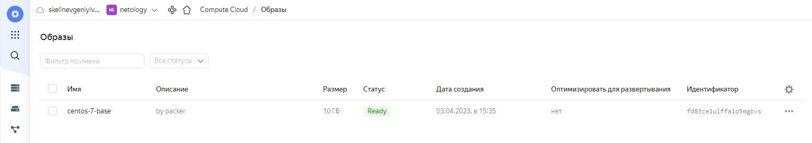

# Домашнее задание к занятию "5.4. Оркестрация группой Docker контейнеров на примере Docker Compose".
## Задача 1
Создать собственный образ операционной системы с помощью Packer.

Для получения зачета, вам необходимо предоставить:

* Скриншот страницы, как на слайде из презентации (слайд 37).

### Решение:
```shell
==> yandex: Stopping instance...
==> yandex: Deleting instance...
    yandex: Instance has been deleted!
==> yandex: Creating image: centos-7-base
==> yandex: Waiting for image to complete...
==> yandex: Success image create...
==> yandex: Destroying boot disk...
    yandex: Disk has been deleted!
Build 'yandex' finished after 6 minutes 17 seconds.

==> Wait completed after 6 minutes 17 seconds

==> Builds finished. The artifacts of successful builds are:
--> yandex: A disk image was created: centos-7-base (id: fd8dla96rtusrmjitpes) with family name centos
root@WIN-71LUFQTKUQO:/home/skelin_ei/05-virt-04-docker-compose/packer#
root@WIN-71LUFQTKUQO:/home/skelin_ei/05-virt-04-docker-compose/packer#
root@WIN-71LUFQTKUQO:/home/skelin_ei/05-virt-04-docker-compose/packer# yc compute image list
+----------------------+---------------+--------+----------------------+--------+
|          ID          |     NAME      | FAMILY |     PRODUCT IDS      | STATUS |
+----------------------+---------------+--------+----------------------+--------+
| fd8dla96rtusrmjitpes | centos-7-base | centos | f2euv1kekdgvc0jrpaet | READY  |
+----------------------+---------------+--------+----------------------+--------+
```



## Задача 2
Создать вашу первую виртуальную машину в Яндекс.Облаке.

Для получения зачета, вам необходимо предоставить:

* Скриншот страницы свойств созданной ВМ.

### Ответ: 


## Задача 3
Создать ваш первый готовый к боевой эксплуатации компонент мониторинга, состоящий из стека микросервисов.

Для получения зачета, вам необходимо предоставить:

* Скриншот работающего веб-интерфейса Grafana с текущими метриками

### Ответ:

