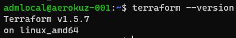
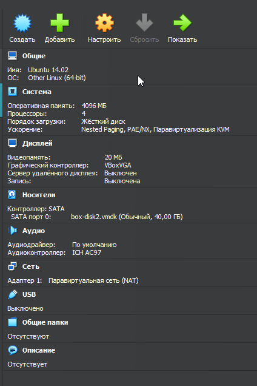

# Домашнее задание к занятию «Введение в Terraform»

### Цели задания

1. Установить и настроить Terrafrom.
2. Научиться использовать готовый код.

------

### Чек-лист готовности к домашнему заданию

1. Скачайте и установите актуальную версию **Terraform** >=1.4.X . Приложите скриншот вывода команды ```terraform --version```.
#### Решение:



2. Скачайте на свой ПК этот git-репозиторий. Исходный код для выполнения задания расположен в директории **01/src**.
3. Убедитесь, что в вашей ОС установлен docker.
4. Зарегистрируйте аккаунт на сайте https://hub.docker.com/, выполните команду docker login и введите логин, пароль.

------

### Инструменты и дополнительные материалы, которые пригодятся для выполнения задания

1. Репозиторий с ссылкой на зеркало для установки и настройки Terraform: [ссылка](https://github.com/netology-code/devops-materials).
2. Установка docker: [ссылка](https://docs.docker.com/engine/install/ubuntu/). 
------

### Задание 1

1. Перейдите в каталог [**src**](https://github.com/netology-code/ter-homeworks/tree/main/01/src). Скачайте все необходимые зависимости, использованные в проекте. 
2. Изучите файл **.gitignore**. В каком terraform-файле, согласно этому .gitignore, допустимо сохранить личную, секретную информацию?
#### Решение:
Сохранять все данные можно в файле с расширением tfstate, файлы с данным расширениием не будут выгружаться в git


3. Выполните код проекта. Найдите  в state-файле секретное содержимое созданного ресурса **random_password**, пришлите в качестве ответа конкретный ключ и его значение.
#### Решение:
```code
"result": "g4xu59qf7wD81e6L",
```

4. Раскомментируйте блок кода, примерно расположенный на строчках 29–42 файла **main.tf**.
Выполните команду ```terraform validate```. Объясните, в чём заключаются намеренно допущенные ошибки. Исправьте их.
#### Решение:
Имя ресурса может начинаться только с нижнего подчекивания либо буквы. а в данном ппримере имя начинается с цифры. Так жжже указана ссылка на несуществующий ресурс с менем "random_string_FAKE". Дополнительно допущена ошибка в правписании в слове resulT последняя буква не должна быть заглавной и не указано имя resource "docker_image".

1. Выполните код. В качестве ответа приложите: исправленный фрагмент кода и вывод команды ```docker ps```.
#### Решене:
Фрагмент кода:
```terraform
resource "docker_image" "nginx" {
  name         = "nginx:latest"
  keep_locally = true
}

resource "docker_container" "nginx" {
  image = docker_image.nginx.image_id
  name  = "example_${random_password.random_string.result}"

  ports {
    internal = 80
    external = 8000
  }
}
```
Вывод docker ps:
```code
docker ps
CONTAINER ID   IMAGE          COMMAND                  CREATED         STATUS         PORTS                  NAMES
7ba9d37ca7f3   f5a6b296b8a2   "/docker-entrypoint.…"   4 seconds ago   Up 3 seconds   0.0.0.0:8000->80/tcp   example_g4xu59qf7wD81e6L
```

2. Замените имя docker-контейнера в блоке кода на ```hello_world```. Не перепутайте имя контейнера и имя образа. Мы всё ещё продолжаем использовать name = "nginx:latest". Выполните команду ```terraform apply -auto-approve```.
Объясните своими словами, в чём может быть опасность применения ключа  ```-auto-approve```. В качестве ответа дополнительно приложите вывод команды ```docker ps```.
#### Решение:
```code
docker ps
CONTAINER ID   IMAGE          COMMAND                  CREATED         STATUS         PORTS                  NAMES
607ae7a28606   f5a6b296b8a2   "/docker-entrypoint.…"   5 seconds ago   Up 3 seconds   0.0.0.0:8000->80/tcp   HelloWorld
```
```-auto-approve``` применяет план без утверждения, а значит если ыли дпущены ошибки и не проверно ключами ```-validate``` и ```-plan``` то моно все "сломать" напимер удалить нужный контенер.

1. Уничтожьте созданные ресурсы с помощью **terraform**. Убедитесь, что все ресурсы удалены. Приложите содержимое файла **terraform.tfstate**. 

#### Решение:

```code
   {
  "version": 4,
  "terraform_version": "1.5.7",
  "serial": 15,
  "lineage": "1fd7d659-271b-f6a1-0cf3-5d747abd6bf5",
  "outputs": {},
  "resources": [],
  "check_results": null
}
```

2. Объясните, почему при этом не был удалён docker-образ **nginx:latest**. Ответ **обязательно** подкрепите строчкой из документации [**terraform провайдера docker**](https://docs.comcloud.xyz/providers/kreuzwerker/docker/latest/docs).  (ищите в классификаторе resource docker_image )

#### Решение:
Насколько я понял из документации без ключа ```keep_locally``` автоматически удалятсяне будет. Так жже можно использовать ключ ```force_remove```

Выдержка из документации:

force_remove (Boolean) If true, then the image is removed forcibly when the resource is destroyed.

keep_locally (Boolean) If true, then the Docker image won't be deleted on destroy operation. If this is false, it will delete the image from the docker local storage on destroy operation.

------

## Дополнительное задание (со звёздочкой*)

**Настоятельно рекомендуем выполнять все задания со звёздочкой.** Они помогут глубже разобраться в материале.   
Задания со звёздочкой дополнительные, не обязательные к выполнению и никак не повлияют на получение вами зачёта по этому домашнему заданию. 

### Задание 2*

1. Изучите в документации provider [**Virtualbox**](https://docs.comcloud.xyz/providers/shekeriev/virtualbox/latest/docs) от 
shekeriev.
2. Создайте с его помощью любую виртуальную машину. Чтобы не использовать VPN, советуем выбрать любой образ с расположением в GitHub из [**списка**](https://www.vagrantbox.es/).

В качестве ответа приложите plan для создаваемого ресурса и скриншот созданного в VB ресурса. 

#### Решение:
```terraform
terraform {
  required_providers {
    virtualbox = {
      source   = "shekeriev/virtualbox"
      version  = "0.0.4"
    }
  }
}

provider "virtualbox" {
  delay        = 60
  mintimeout   = 5
}

resource "virtualbox_vm" "vm2" {
    name       = "Ubuntu 14.02"
    image      = "./ubuntu-14.04-amd64.box"
    cpus       = 4
    memory     = "4096 mib"
    network_adapter {
    type       = "nat"
    device     = "VirtIO"
  }
}
```


------

### Правила приёма работы

Домашняя работа оформляется в отдельном GitHub-репозитории в файле README.md.   
Выполненное домашнее задание пришлите ссылкой на .md-файл в вашем репозитории.

### Критерии оценки

Зачёт ставится, если:

* выполнены все задания,
* ответы даны в развёрнутой форме,
* приложены соответствующие скриншоты и файлы проекта,
* в выполненных заданиях нет противоречий и нарушения логики.

На доработку работу отправят, если:

* задание выполнено частично или не выполнено вообще,
* в логике выполнения заданий есть противоречия и существенные недостатки. 